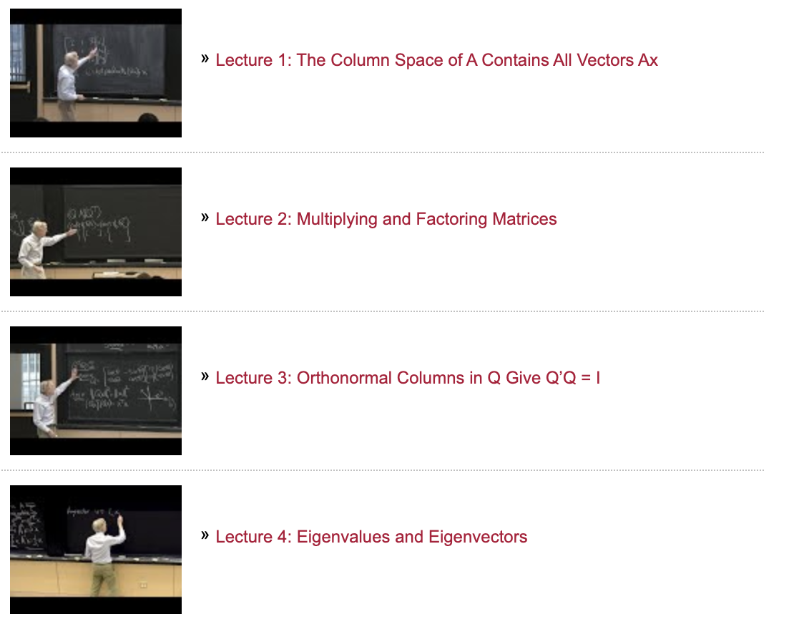

# Online math resources for Machine Learning

# Content

- [Books](#books)
- [Videos](#videos)

# Books

## Math for Machine Learning

- Link to:
  - [Book Homepage](https://mml-book.github.io/)
  - [Companion notebooks](https://github.com/vbartle/MML-Companion) with code along (Chapter 2-7)
  - Another self-study [notebooks](https://github.com/ilmoi/MML-Book) with playground python code and solution of chapters 2-7
  - [Reading group video playlists](https://www.youtube.com/watch?v=nOxQ1vRt_p0&list=PLaPdEEY26UXygpV-Cxch8Xkpl7IbFKBvK) from Machine Learning Tokyo

**Part I: Mathematical Foundations**

1. Introduction and Motivation
2. Linear Algebra
3. Analytic Geometry
4. Matrix Decompositions
5. Vector Calculus
6. Probability and Distribution
7. Continuous Optimization

**Part II: Central Machine Learning Problems**

8. When Models Meet Data
9. Linear Regression
10. Dimensionality Reduction with Principal Component Analysis
11. Density Estimation with Gaussian Mixture Models
12. Classification with Support Vector Machines

# Videos

## 3blue1brown

3blue1brown, by Grant Sanderson, is some combination of math and entertainment, depending on your disposition. The goal is for explanations to be driven by animations and for difficult problems to be made simple with changes in perspective.

- **Recommend video series:**
  - [Essence of Linear Algebra](https://www.youtube.com/playlist?list=PLZHQObOWTQDPD3MizzM2xVFitgF8hE_ab)
  - [Essence of Calculus](https://www.youtube.com/playlist?list=PLZHQObOWTQDMsr9K-rj53DwVRMYO3t5Yr)

## The classic: Gilbert Strang MIT lectures on Linear Algebra

**Matrix Methods in Data Analysis, Signal Processing, and Machine Learning**
- **Spring 2018**
- **Level:** Undergraduate / Graduate
- **Course description:** "Linear algebra concepts are key for understanding and creating machine learning algorithms, especially as applied to deep learning and neural networks. This course reviews linear algebra with applications to probability and statistics and optimization–and above all a full explanation of deep learning."
- **Format:** [Video lectures](https://ocw.mit.edu/courses/mathematics/18-065-matrix-methods-in-data-analysis-signal-processing-and-machine-learning-spring-2018/)

## Mathematics for Machine Learning offered by Imperial College London university

- Playlists:
  - [Linear Algebra](https://www.youtube.com/watch?v=T73ldK46JqE&list=PLiiljHvN6z1_o1ztXTKWPrShrMrBLo5P3)
  - [Multivariate Calculus](https://www.youtube.com/watch?v=cWZLPv4ZJhE&list=PLiiljHvN6z193BBzS0Ln8NnqQmzimTW23)

# Credits

https://github.com/Machine-Learning-Tokyo/Math_resources
